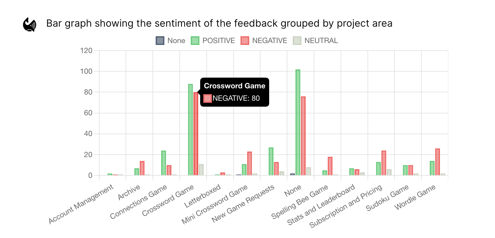
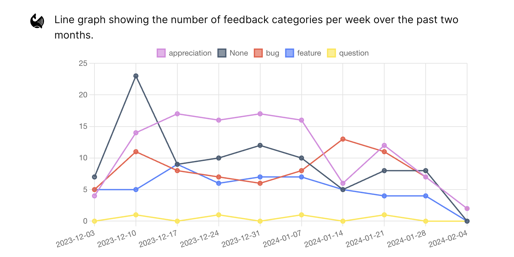

Delve deep into your feedback with "Ask Monty", an advanced GPT-4 enabled analysis tool. Pose questions regarding your feedback data, and let Monty analyze, visualize and provide insightful answers.

### **Key Features**

- **Ask Monty:** Directly ask Monty any query related to the feedback in your workspace.
- **Save & Revisit**: Save crucial questions for easy future reference.
- **Share Insights**: Generate a public link to share the question and its answer with others.
- **Set Parameters**: Customize the data Monty considers by adjusting parameters like date range, contract value, sources, category, and metadata.
- **Stay Updated**: Use the refresh action to ensure you're always working with the most recent feedback data.
- **Citations**: Quickly access the feedback supplying insights.
- **Request Visuals**: Ask Monty to plot or visualize your requests to produce shareable visualizations and charts about your query. You can also chat with that visual later in your conversation!

### **Usage Guide**

Ask Monty is Monterey AI's LLM enabled chat tool designed to extract deep insights from your feedback data.

The conversation is started entering by enetering an initial query. This query will be used to generate the dataset(s) that will supply the entire message chain.
The datasets will be constructed via filters extracted from your query, and may include filters on the feedback creation date, category/project labels and metadata values.
If you're query is applicable to multiple filter sets, you will turn recieve multiple datasets in response.

For example, the initial query: "compare the bug reports of the spelling bee game to crossword games over the past 6 months" could return the datasets:

```text
- Category: bug | Project: spelling bee game | Date: 07-01-2023 - present
- Category: bug | Project: crossword game    | Date: 07-01-2023 - present
```

You will have the opportunity to edit, add and remove datasets as needed at this step as well.

Once your datasets are confirmed, the Ask Monty engine determines the type of response most applicable to your query. At the time the support intent routes include:

- Text: the query is best answered via a text response (summarizations, qualitative comparisons, example finding, etc.)
- Chart: the query is best answered via a chart visualization

Monty will then return a response using the most applicable intent to answer the user query.

After the initial response, the user may ask any number of follow ups or explanations to previous responses (including asking follow ups to chat based responses).

### **Chart Support**

Ask Monty supports chart based responses when it is determined a figure would be the best way to answer a user query.

While the system is designed to determine the appropriate response type with any user query input, you can ensure a chart based response with keywords similar to "plot", "show", "visualize", etc..



The supported charts include:

- Bar plots for categorical/grouped distributions and counts
- Line plots for temporal distributions and counts
- Pie plots for single category/group distributions

The values that can supply those charts include:

- Feedback source
- Sentiment
- Feedback dates
- Categories
- Project Labels (if enabled)
- Dataset groups from current conversation
- Metadata\*



\*_Metadata support is enabled for metadata fields that are present for at least 25% of a dataset's feedback, working for numerical, date and categorical types._

### Conversation Navigation

- **Top Questions**: Get inspired or quickly access frequently asked questions.
- **Recent Questions**: View your question history, ensuring you never lose track of previously sought insights.
- **Saved Questions**: Keep important queries handy by saving them, so you can revisit or re-analyze them whenever you need.
