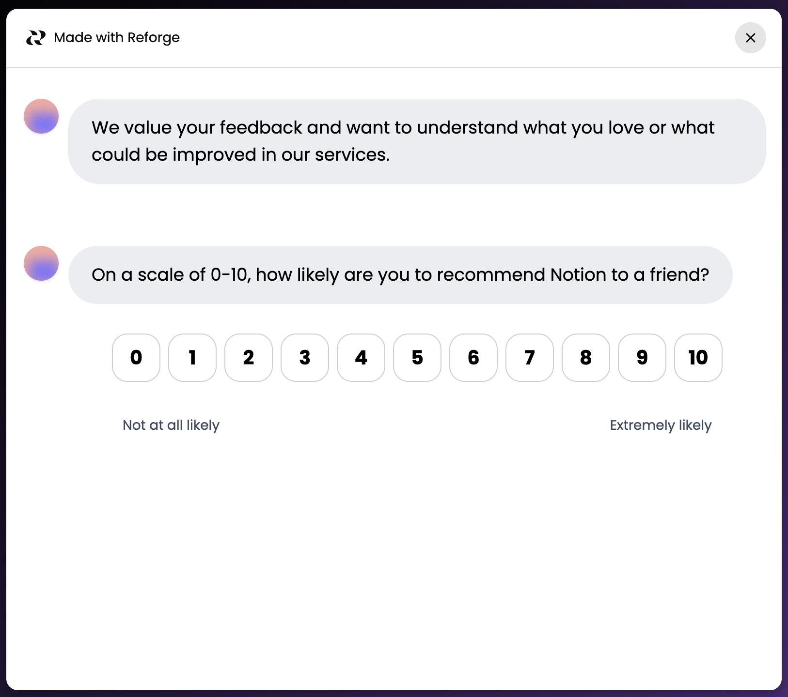

## Set up in-app research

To set up your in-app research widget, go to [In-app research settings](https://insights.reforge.com/w/default/settings/in-app-research)

Copy the widget script and add it to your page. Pass your current user's info in the `user` object in the `init` call. If you do not have a current user, you should pass a stable anonymous ID.

## Show research opportunities

When you want to show a research opportunity to a user, call the appropriate method:

- `ReforgeResearch("any.show")` - Show any available research opportunity
- `ReforgeResearch("surveys.show", {token: "SHARE_TOKEN"})` - Show a specific survey
- `ReforgeResearch("interviews.show", {token: "SHARE_TOKEN"})` - Show a specific interview

You can get the share token for a survey or interview from its individual settings tab.

## Targeting

The widget supports targeting rules to control who sees your surveys and interviews. You can target users based on:

- **Browser properties:** URL, page title, referrer, user agent, language, timezone
- **User properties:** ID, email, and custom attributes you pass during initialization
- **Time & date properties:** timestamp, time of day, day of week
- **Contact properties:** Custom attributes from your CRM or user database

For the full targeting documentation including display approaches (automatic polling, custom UI, one-time checks), available operators, and common use cases, see the [In-app research targeting settings](https://insights.reforge.com/w/default/settings/in-app-research?tab=targeting).

## Notes

**Availability rules:** Available research opportunities are determined by the widget at first available research opportunity that is:
- Active (launched/live)
- Not already answered by the user
- Not dismissed by the user within the last 30 days

For testing purposes, you can pass `{ force: true }` when showing any research opportunity to bypass availability rules. Example: `ReforgeResearch("interviews.show", { token: "SHARE_TOKEN", force: true })`

**Lazy loading:** The widget uses a minimal initial bundle and lazy-loads survey or interview components on demand, keeping your page load times fast.
