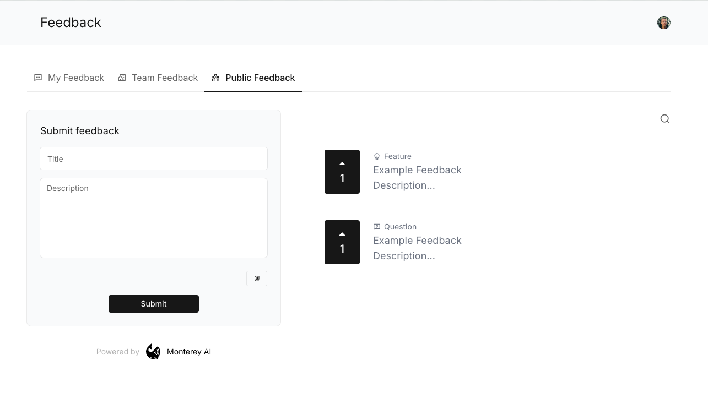
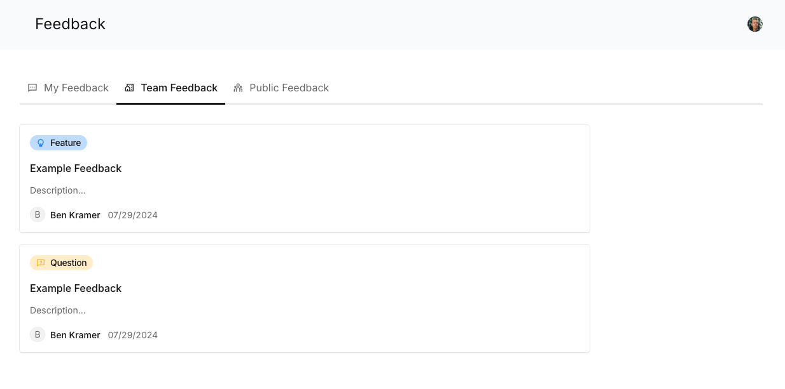
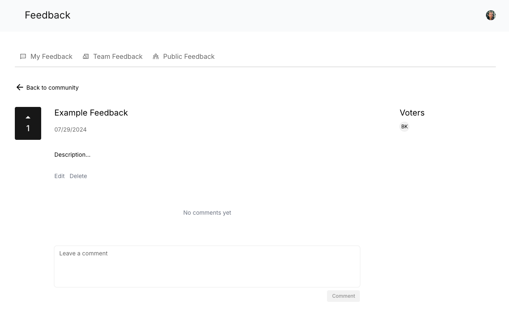
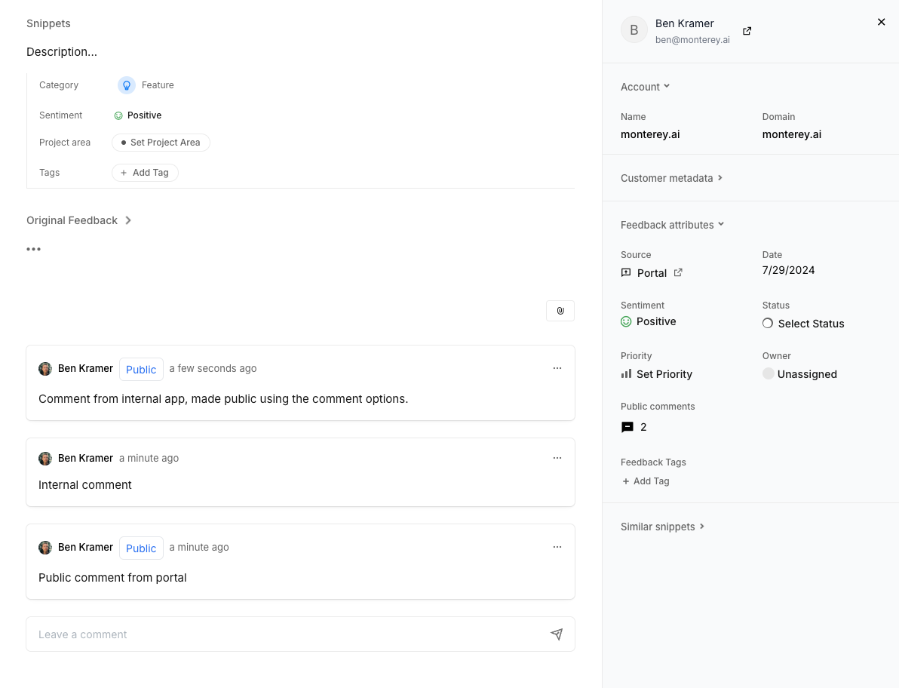
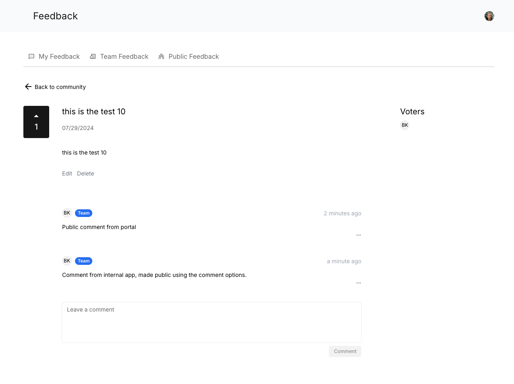

## Branding

Under "Tools" in your navigation menu, you will find the _Portal_ menu.

<Steps>
  <Step title="Choose a subdomain">
    Typically, this would be your company name!
  </Step>
  <Step title="[optional] Set the primary and secondary branding colors" />
  <Step title="[optional] Enter a link to your company's logo" />
  <Step title="Click 'Save'" />
</Steps>

## Roadmap

To utiliize the roadmap, go back to the navigation menu, and choose "Roadmap" in the _Portal_ section.

The roadmap allows you to share projects and their status with your customers.

<Steps>
  <Step title="Enable the toggle at the top of the page" />
  <Step title="Add your first Roadmap item - Click '+ New Item'">
    This can be as granular as you'd like. We often see customers use it at a
    "project" or "feature" level, such that the items are meaningful to users,
    and there aren't so many that it becomes overwhelming.
  </Step>
  <Step title="Enter the item details">
    You can configure the title, description, status, labels, and author, as
    well as a cover image!
  </Step>
  <Step title="Publish or save a Draft">
    By default, the save button at the bottom right will save as a 'draft',
    meaning it is only visibile internally and not to your users on the public
    portal Roadmap view. If you are ready to publish it to the public, then you
    can click the arrow on the button and switch to 'publish' mode. Don't worry,
    you can delete the item, or convert it back to a draft later!
  </Step>
</Steps>

**Commenting**
When portal users comment on a roadmap item, that comment will become a Feedback record inside of Monterey AI, and become visible on the public portal feedback list.

## Feedback Board

To utilize the feedback board to provide your users with a way to provide feedback to you, go back to the navigation menu, and choose "Feedback board" in the _Portal_ section.

Simply toggle "Enable Public Voting Board" and then you can utilize your portal link to share with customers, or link to from your own sites and apps.

### Feedback Tracking

There is an additional option here - "Feedback Tracking" that can be enabled. This will allow users to view feedback submitted to your Monterey AI workspace from **any** source by them, or users in the same organization.

This can be useful if you wish to allow users from a given company to understand what has already been asked or requested by them and their teammates. Only users who have signed in with a work email will be able to access the additional views here. For example, users with "@gmail.com" will not have access, but users with "@company-name.com" will!

Note that these views will show the feedback content (title & description), who posted the feedback, and when. They will also be able to comment on this feedback.

The following screenshot shows how the list of feedback submitted by the logged in users team will appear.

This next screenshot shows how one of those individual items from the list view above will appear.

## Comments on Portal Feedback

After users have submitted feedback to the Feedback board or on a Roadmap item, comments may be made on that feedback, both by public users, as well as users internal to your team.

Comments made to the Monterey AI internal app view will be private by default, and not displayed publicly. They can be optionally made public, if desired to reply to the external users.

When viewed in the internal view of Monterey, that your team has access to, you can see both public and private comments.

When viewing on the portal, only public comments will be displayed.

